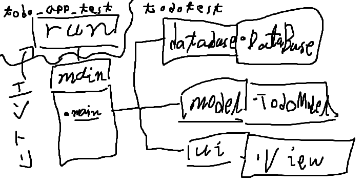

# どんな構造？  
下図を参照  
  

適当に書くと  
1. `run.py`がエントリポイント  
2. `main.py`がメイン関数
3. `database`、`model`、`ui`がそれぞれSQLアクセス、Viewからdatabaseへのアクセス制御、View
4. `runpy`と`main.py`、`database`、`model`、`ui`は別ファイル

こんな感じ
